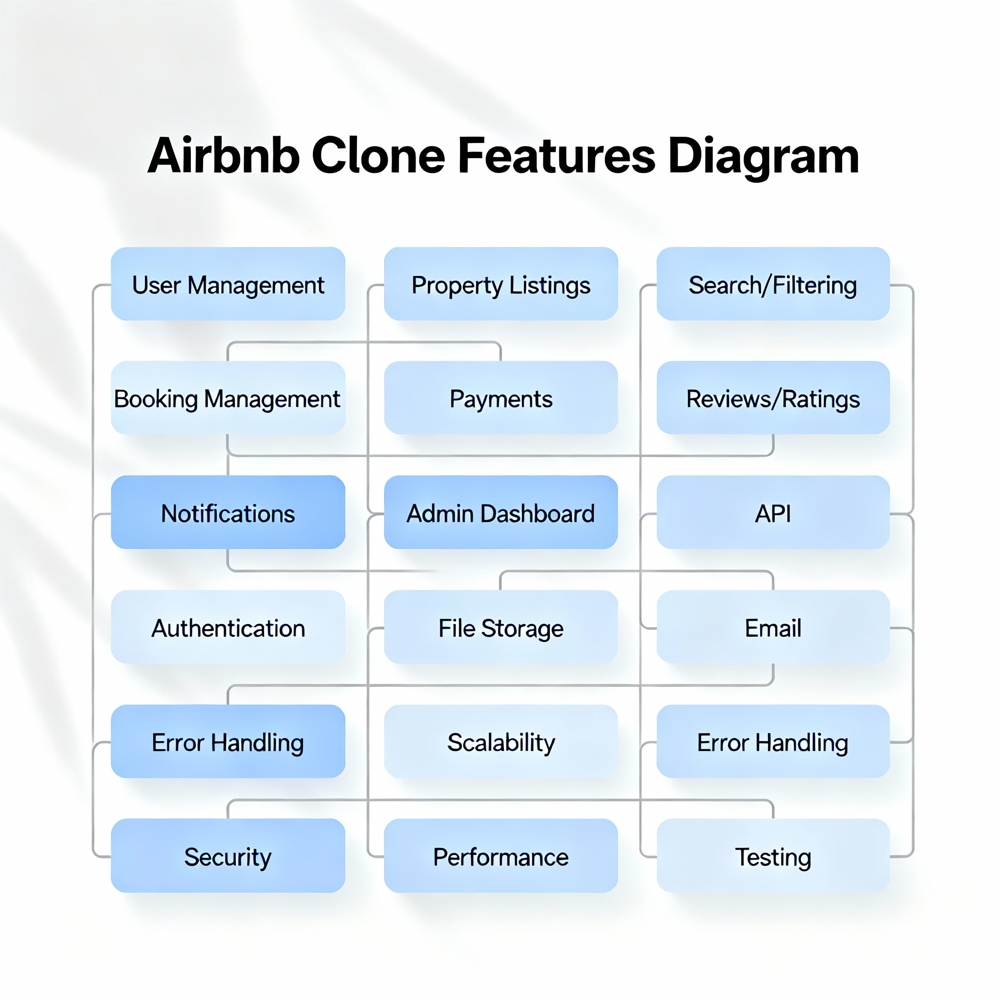

# Project Requirements for the Airbnb Clone Backend

## Core Functionalities

### User Management
- User registration for guests and hosts
- Secure authentication methods, including JWT
- User login with email and password
- OAuth login options (Google, Facebook)
- Profile management for updating profile photo, contact info, and preferences

### Property Listings Management
- Hosts create listings with title, description, location, price, amenities, and availability
- Hosts update or delete listings

### Search and Filtering
- Search properties by location, price range, guest number, and amenities
- Pagination for large datasets

### Booking Management
- Guests book properties for specified dates
- Date validation prevents double bookings
- Booking cancellation for guests and hosts (per cancellation policy)
- Booking statuses: pending, confirmed, canceled, completed

### Payment Integration
- Secure payment gateways (Stripe, PayPal)
- Upfront guest payment and automatic host payouts
- Support for multiple currencies

### Reviews and Ratings
- Guests leave reviews and ratings for properties
- Hosts respond to reviews
- Reviews linked to bookings

### Notifications System
- Email and in-app notifications for booking confirmations, cancellations, and payment updates

### Admin Dashboard
- Monitor and manage users, listings, bookings, and payments

## Technical Requirements

### Database Management
- Relational database (PostgreSQL or MySQL)
- Tables: Users, Properties, Bookings, Reviews, Payments

### API Development
- RESTful APIs to expose backend functionality
- Proper HTTP methods and status codes for GET, POST, PUT/PATCH, DELETE
- Optional GraphQL support for complex queries

### Authentication and Authorization
- JWT for secure sessions
- Role-based access control (Guests, Hosts, Admins)

### File Storage
- Store property images and user profile photos in cloud storage (AWS S3 or Cloudinary)

### Third-Party Services
- Email service integration (SendGrid or Mailgun) for notifications

### Error Handling and Logging
- Global API error handling

## Non-Functional Requirements

### Scalability
- Modular architecture
- Horizontal scaling with load balancers

### Security
- Data encryption for sensitive information
- Firewalls and rate limiting

### Performance Optimization
- Caching (Redis) for search and frequently accessed data
- Database query optimization

### Testing
- Unit and integration testing (pytest)
- Automated API tests

---

